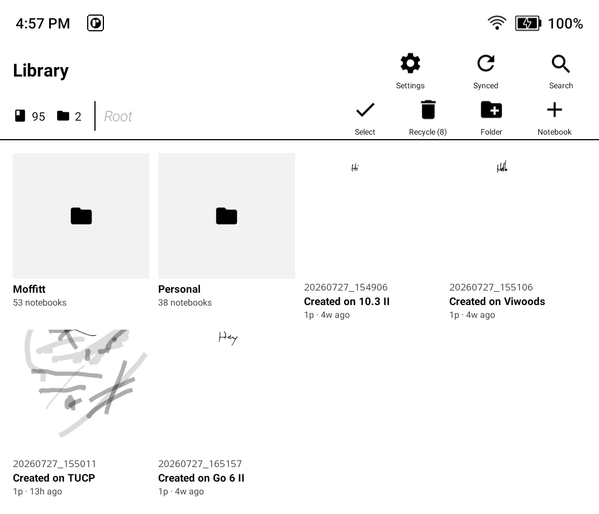

# ForestNote

A handwriting-first note app for e-ink tablets. ForestNote is built for low-latency
inking on the [Viwoods AiPaper Mini](https://www.viwoods.com/) and Boox/Onyx devices,
so the ink keeps up with your pen instead of lagging a few strokes behind. On any other
Android device it falls back to a standard canvas.

> **Status:** version 2.0 release candidate, validated on Viwoods and Boox USI/EMR devices and ready
> for the final release tag.

  

## What you can do

- **Write** with 17 portable brush styles: fountain, five pencil grades, brush, ballpoint,
  two markers, fineliner, four calligraphy nibs, highlighter, and dashed line.
- **Erase** by stroke (wipe a whole line) or by pixel (rub out part of one). A hardware
  eraser button, if your stylus has one, works too.
- **Choose a page template** — blank, dot, ruled, or grid — per page or as a notebook default,
  at 5, 7, or 10 mm spacing.
- **Organize** into notebooks and pages, group notebooks into folders, and browse it all in
  a Library with thumbnails, search, and a recycle bin.
- **Select with the lasso** — grab strokes and text together, then cut, copy, delete, drag to
  move, or paste somewhere else.
- **Type text boxes** alongside your handwriting, with font, size, weight, and layering.
- **Recognize handwriting** into editable text on-device (Google ML Kit), no round-trip to a server.
- **Transcribe a complete page** through an optional OpenAI-compatible or Anthropic-compatible
  vision endpoint. This is manual-only; local recognition remains available.
- **Send a scribble to your calendar** — lasso a to-do, and ForestNote turns it into a task on
  any CalDAV server, queued offline until you're back online.
- **Sync across devices** against a self-hosted UltraBridge server, with conflict-free
  multi-master merging.
- **Export or back up locally** without an account: selected notebooks go to PDF/SVG/ZIP,
  and a complete `.forestnote-backup` can be restored through the system file picker.

Step-by-step instructions for each of these live in the **[user guide](docs/user-guide.md)**.

## Supported devices

| Device | How ink is drawn |
|--------|------------------|
| Viwoods AiPaper Mini | Direct ENote digitizer callbacks + firmware partial refresh |
| Boox / Onyx | Onyx Pen SDK — the firmware renders live ink directly to the panel |
| Any other Android (SDK 30+) | Standard canvas redraw — works, but without the firmware speed-up |

The backend is detected at launch. Saved strokes use ForestNote's own brush identities and
deterministic renderer; vendor pen styles are only low-latency previews while the stylus is down.

## Installing

ForestNote ships as a sideloaded APK; there's no Play Store listing. Download the current APK
from [GitHub Releases](https://github.com/jdkruzr/ForestNote/releases/latest), copy it to the
tablet, and open it to install.

Install an update over the existing app; do not uninstall first. On first launch, ForestNote offers
an external library under `/sdcard/ForestNote` or an app-private library. Both work entirely
offline. See [Getting started](docs/guide/getting-started.md) for the storage tradeoff and make a
backup before changing devices or testing sync.

On Viwoods, the fastest ink mode is enabled by default and **does not require root**. It runs from
the same ordinary sideloaded app process as the rest of ForestNote. The setting under **Settings
→ Debug** can disable it if a future firmware update breaks the private API; ForestNote then falls
back to the older Android-input path. Root was useful to investigate the firmware and to work
around the test tablet's restricted package shell, but it is not used by the installed app.

ForestNote is fully usable without network access or an account. Handwriting recognition is
optional and downloads a language model on demand (roughly 20 MB per language); recognition runs
on the tablet after that. Building from source requires the Viwoods ink and Rhizome repositories as
siblings, so follow the complete [build guide](docs/development/building.md) rather than treating
this repository as a standalone Gradle checkout.

## Under the hood

Kotlin, Android Views (no Compose), Material 3, minimum SDK 30. Storage is
[SQLDelight](https://sqldelight.github.io/sqldelight/) over SQLite; stroke geometry uses
[Jetpack Ink](https://developer.android.com/jetpack/androidx/releases/ink). The build is
multi-module Gradle with shared config in `build-logic/`.

| Module | Responsibility |
|--------|----------------|
| `app/notes` | The app — activity, drawing surface, toolbar, Library, settings, recognition, CalDAV, sync wiring |
| `core/ink` | Ink backends (Viwoods / Boox / generic), the stroke model, coordinate transform, geometry |
| `core/format` | SQLite storage (folder → notebook → page → stroke) and the sync data binding |
| `core/sync` | The app-specific sync timing and join policy |

Every stroke is stored in a resolution-independent virtual coordinate space, so notes render the
same across screen sizes and orientations. The [documentation index](docs/README.md) separates
current user/developer references from historical plans and research; module-level `CLAUDE.md`
files document invariants closest to the code.

## License

[Apache 2.0](LICENSE) © 2026 jdkruzr. See [LICENSE](LICENSE) and [NOTICE](NOTICE).
